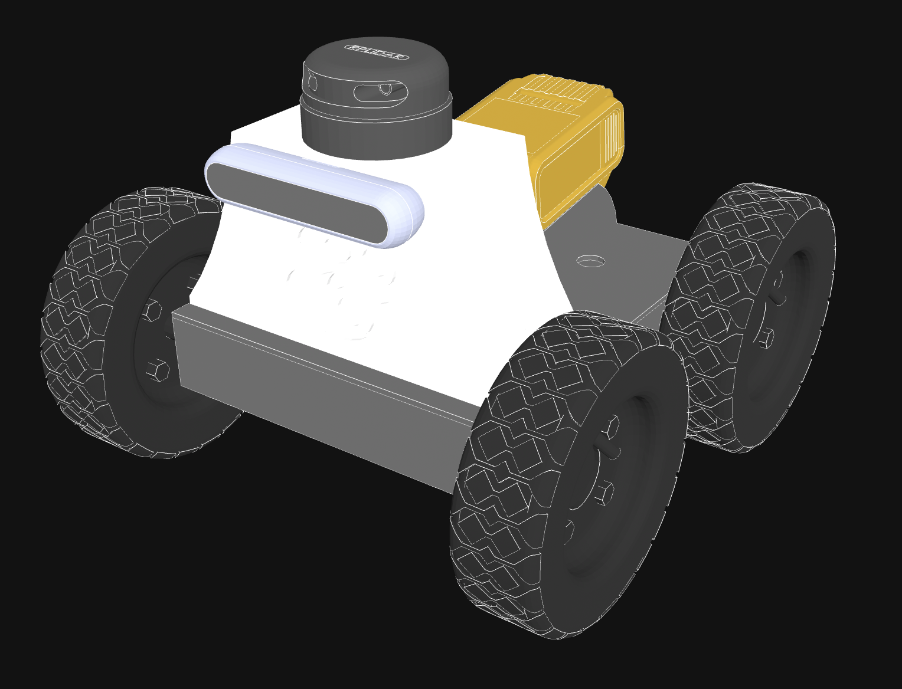

# Scout Robot

<p align="center">
  
</p>

## Running
```bash
docker compose build
```
```bash
docker compose --profile build run --rm build_package
```
```bash
docker compose up
```
(`robot` + `slam` + `nav2` + `foxglove_bridge`. Joystick on by default; disable with
`docker compose run --rm robot ros2 launch scout robot.launch.py enable_joystick:=false`.)

After switching off the old `ros_ws_install` volume, once:
```bash
docker compose down -v
```
then `docker compose build` and `build_package` so the new `ros_overlay_install` volume seeds from the image and Scout lands in `$OVERLAY`.

```bash
docker compose exec slam /ros_entrypoint.sh ros2 service call   /slam_toolbox/serialize_map slam_toolbox/srv/SerializePoseGraph   "{filename: /ros_ws/src/maps/office}"
```